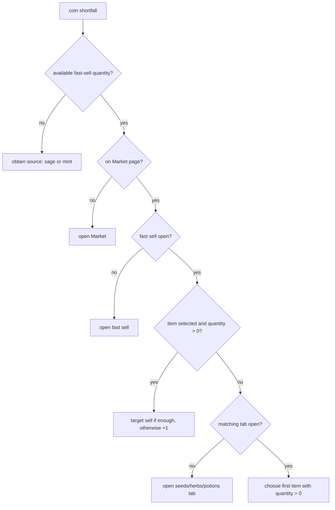

# Coin Shortfall Branch

Level-up steps can route through Market when the player is short on coin.

## Routing Logic

## Guardrail

Coin guidance reads Market `shop.shelf.sellItems` quantities. Raw inventory may
include items reserved by Garden, Brewing, or listings, so it can point at items
that fast sell correctly shows as unavailable.

## Related

- [[Level 2 Market]]
- [[Tutorial Risks]]
