# Tutorial Flow

Source: `src/pages/tutorial/managers/TutorialStepManager.js`.

Screenshots are captured from the real Vite game surface at the authored `1080x2170` viewport. Run `npm run tutorial:capture` to start the shared dev server when needed, pass the live tutorial, and refresh the PNGs/contact sheet.

The automation uses the real `TutorialFacade`, CSS, Elara assets, and `data-tutorial-id` targets. Dev capture hooks only skip waits/background resource tasks and hide the local offline gate so the screenshots show the actual game UI, not a harness.

Current source starts with a purchase dialog and routes room openings through short `market opened`, `garden opened`, `research opened`, and `brewing opened` beats. Username setup is no longer part of FTUE; player-facing social surfaces ask for it when first opened. The Garden opening beat waits until the player has a sage seed or active sage crop; otherwise lesson 3 starts from Workshop requirements and summon guidance so the player is not sent to an empty Garden and back. The first fast-sell lesson selects the item, highlights the selected amount for two seconds without a pointer, then advances to the `sell` button without player input. Coin-shortfall guidance uses the Market `sellItems` available quantity, not raw inventory, so reserved items that show as `x0` do not become targets. The screenshot set below predates those routing and room-open changes and should be refreshed the next time tutorial captures are regenerated.

## Graph

```mermaid
flowchart TD
  S01["1. intro-welcome<br/>lesson 1: introduction"]
  S02["2. intro-mana-sphere<br/>target: top-panel mana"]
  S03["3. first-summon-seed<br/>target: summon"]
  S04["4. first-fill-seed-task<br/>target: task fill"]
  S05["5. finish-seed-task<br/>objective: seed task"]
  S06["6. intro-market<br/>lesson 2: market"]
  S07["7. prepare-seed-sale<br/>objective: one seed to sell"]
  S08["8. open-market<br/>target: market tab"]
  S09["9. select-market-stand<br/>target: fast sell button"]
  S10["10. select-sage-seed-sale<br/>target: fast sell sage seed row"]
  S11["11. show-selected-sale-amount<br/>highlight: selected amount"]
  S12["12. earn-tutorial-coin<br/>effect: tutorial fast sell"]
  S13["13. unselect-sage-seed-sale<br/>target: empty picker row"]
  S14["14. level-up-one<br/>target: level up"]
  S15["15. grow-sage<br/>lesson 3: gardening"]
  S16["16. fill-sage-herb-task<br/>objective: sage task"]
  S17["17. level-up-two<br/>target: level up or market"]
  S18["18. research-mint-seed<br/>passive"]
  S19["19. fill-mint-seed-task<br/>passive"]
  S20["20. fill-mint-herb-task<br/>passive"]
  S21["21. level-up-three<br/>passive"]
  S22["22. research-mana-tonic<br/>lesson 4: brewing"]
  S23["23. brew-mana-tonic<br/>objective: first potion"]
  S24["24. refill-mana-tonic-cauldron<br/>objective: refill cauldron"]
  Done["tutorial hidden / complete"]
  G00["coin shortfall"]
  G01{"available fast-sell quantity?"}
  G02["no: obtain source<br/>sage or mint"]
  G03{"on Market page?"}
  G04["no: open Market"]
  G05{"fast sell open?"}
  G06["no: open fast sell"]
  G07{"item selected and quantity > 0?"}
  G08["yes: target sell if enough<br/>otherwise +1"]
  G09{"matching tab open?"}
  G10["no: open seeds/herbs/potions tab"]
  G11["yes: choose first item<br/>with quantity > 0"]

  S01 -->|"next"| S02
  S02 -->|"next, mana ready"| S03
  S03 -->|"seed gained"| S04
  S04 -->|"first fill done"| S05
  S05 -->|"seed task complete"| S06
  S06 -->|"next"| S07
  S07 -->|"seed exists"| S08
  S08 -->|"Market opened"| S09
  S09 -->|"fast sell opened"| S10
  S10 -->|"sage seed selected"| S11
  S11 -->|"2 seconds"| S12
  S12 -->|"10 coin earned"| S13
  S13 -->|"stand emptied"| S14
  S14 -->|"level 2"| S15
  S15 -->|"sage grown"| S16
  S16 -->|"sage task complete"| S17
  S17 -->|"level 3"| S18
  S18 -->|"mint seed research complete"| S19
  S19 -->|"mint seed task complete"| S20
  S20 -->|"mint herb task complete"| S21
  S21 -->|"level 4"| S22
  S22 -->|"mana tonic research started/completed"| S23
  S23 -->|"first mana tonic brewed"| S24
  S24 -->|"mana tonic task complete, active brew, or level 5"| Done

  S03 -. "paused while mana is not ready" .-> S03
  S05 -. "target can switch: tasks, task row, summon, mana" .-> S05
  S17 -. "if coin short" .-> G00
  S21 -. "if coin short" .-> G00
  G00 --> G01
  G01 -->|"no"| G02
  G01 -->|"yes"| G03
  G03 -->|"no"| G04
  G03 -->|"yes"| G05
  G05 -->|"no"| G06
  G05 -->|"yes"| G07
  G07 -->|"yes"| G08
  G07 -->|"no"| G09
  G09 -->|"no"| G10
  G09 -->|"yes"| G11
```

## Screenshots

The table below is the last captured screenshot set and does not yet include `show-selected-sale-amount`.

| Step | Screenshot |
|---|---|
| 1. `intro-welcome` |  |
| 4. `intro-mana-sphere` |  |
| 5. `first-summon-seed` |  |
| 6. `first-fill-seed-task` |  |
| 7. `finish-seed-task` |  |
| 8. `intro-market` |  |
| 9. `prepare-seed-sale` |  |
| 10. `open-market` |  |
| 11. `select-market-stand` |  |
| 12. `select-sage-seed-sale` |  |
| 13. `earn-tutorial-coin` |  |
| 14. `unselect-sage-seed-sale` |  |
| 15. `level-up-one` |  |
| 16. `grow-sage` |  |
| 17. `fill-sage-herb-task` |  |
| 18. `level-up-two` |  |
| 19. `research-mint-seed` |  |
| 20. `fill-mint-seed-task` |  |
| 21. `fill-mint-herb-task` |  |
| 22. `level-up-three` |  |
| 23. `research-mana-tonic` |  |
| 24. `brew-mana-tonic` |  |
| 25. `refill-mana-tonic-cauldron` |  |

## Files

- Automation: `scripts/capture-tutorial-flow.js`
- Contact sheet: `docs/tutorial-flow/contact-sheet.png`
- Individual PNGs: `docs/tutorial-flow/screenshots/`
