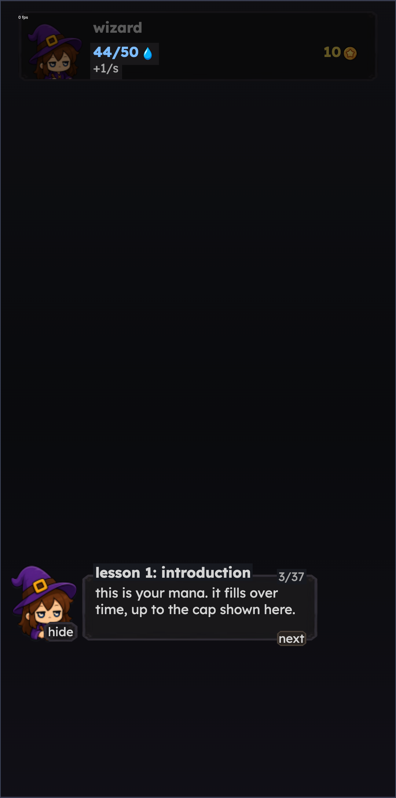
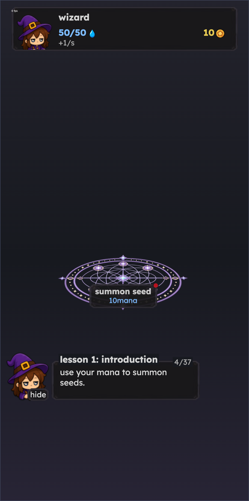

# Tutorial Flow

Source: `src/pages/tutorial/managers/TutorialStepManager.js`.

Screenshots were captured at the authored `1080x2170` viewport with the real `TutorialFacade`, real CSS, and real Elara assets. The page controls are deterministic harness controls with the same `data-tutorial-id` targets, so captures do not touch live saves or SpacetimeDB.

## Graph

```mermaid
flowchart TD
  S01["1. intro-welcome<br/>lesson 1: seeding<br/>target: username"]
  S02["2. intro-mana-sphere<br/>target: mana sphere"]
  S03["3. first-summon-seed<br/>target: summon"]
  S04["4. first-fill-seed-task<br/>target: task fill"]
  S05["5. finish-seed-task<br/>objective: seed task"]
  S06["6. intro-market<br/>lesson 2: market"]
  S07["7. prepare-seed-sale<br/>objective: one seed to sell"]
  S08["8. open-market<br/>target: market tab"]
  S09["9. select-market-stand<br/>target: stand 1"]
  S10["10. select-sage-seed-sale<br/>target: sage seed picker row"]
  S11["11. earn-tutorial-gold<br/>effect: tutorial sale"]
  S12["12. unselect-sage-seed-sale<br/>target: empty picker row"]
  S13["13. level-up-one<br/>target: level up"]
  S14["14. grow-sage<br/>lesson 3: gardening"]
  S15["15. fill-sage-herb-task<br/>objective: sage task"]
  S16["16. level-up-two<br/>target: level up or market"]
  S17["17. research-mint-seed<br/>passive"]
  S18["18. fill-mint-seed-task<br/>passive"]
  S19["19. fill-mint-herb-task<br/>passive"]
  S20["20. level-up-three<br/>passive"]
  S21["21. research-mana-tonic<br/>lesson 4: brewing"]
  S22["22. brew-mana-tonic<br/>objective: first potion"]
  S23["23. refill-mana-tonic-cauldron<br/>objective: refill cauldron"]
  Done["tutorial hidden / complete"]

  S01 -->|"next"| S02
  S02 -->|"next, mana ready"| S03
  S03 -->|"seed gained"| S04
  S04 -->|"first fill done"| S05
  S05 -->|"seed task complete"| S06
  S06 -->|"next"| S07
  S07 -->|"seed exists"| S08
  S08 -->|"Market opened"| S09
  S09 -->|"stand selected"| S10
  S10 -->|"sage seed selected"| S11
  S11 -->|"10 gold earned"| S12
  S12 -->|"stand emptied"| S13
  S13 -->|"level 2"| S14
  S14 -->|"sage grown"| S15
  S15 -->|"sage task complete"| S16
  S16 -->|"level 3"| S17
  S17 -->|"mint seed research complete"| S18
  S18 -->|"mint seed task complete"| S19
  S19 -->|"mint herb task complete"| S20
  S20 -->|"level 4"| S21
  S21 -->|"mana tonic research started/completed"| S22
  S22 -->|"first mana tonic brewed"| S23
  S23 -->|"mana tonic task complete, active brew, or level 5"| Done

  S03 -. "paused while mana is not ready" .-> S03
  S05 -. "target can switch: tasks, task row, summon, mana" .-> S05
  S16 -. "if gold short: Market stand" .-> S16
  S20 -. "if gold short: Market stand" .-> S20
```

## Screenshots

| Step | Screenshot |
|---|---|
| 1. `intro-welcome` |  |
| 2. `intro-mana-sphere` |  |
| 3. `first-summon-seed` |  |
| 4. `first-fill-seed-task` |  |
| 5. `finish-seed-task` |  |
| 6. `intro-market` |  |
| 7. `prepare-seed-sale` |  |
| 8. `open-market` |  |
| 9. `select-market-stand` |  |
| 10. `select-sage-seed-sale` |  |
| 11. `earn-tutorial-gold` |  |
| 12. `unselect-sage-seed-sale` |  |
| 13. `level-up-one` |  |
| 14. `grow-sage` |  |
| 15. `fill-sage-herb-task` |  |
| 16. `level-up-two` |  |
| 17. `research-mint-seed` |  |
| 18. `fill-mint-seed-task` |  |
| 19. `fill-mint-herb-task` |  |
| 20. `level-up-three` |  |
| 21. `research-mana-tonic` |  |
| 22. `brew-mana-tonic` |  |
| 23. `refill-mana-tonic-cauldron` |  |

## Files

- Harness: `docs/tutorial-flow/index.html`
- Harness script: `docs/tutorial-flow/tutorial-flow.js`
- Contact sheet: `docs/tutorial-flow/contact-sheet.png`
- Individual PNGs: `docs/tutorial-flow/screenshots/`
