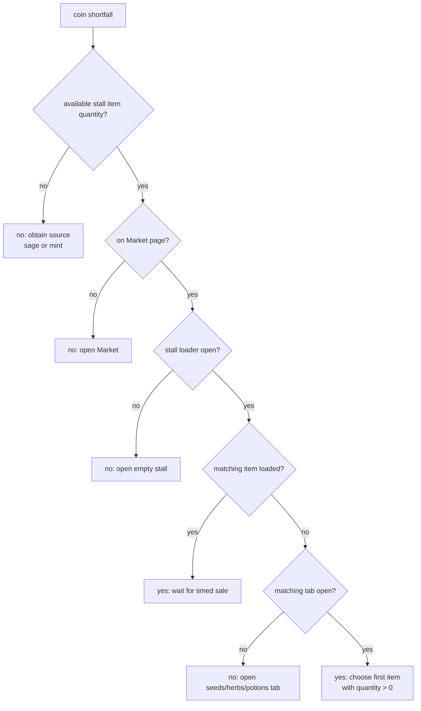

# Tutorial Flow

Source: `src/pages/tutorial/managers/TutorialStepManager.js`.

Screenshots are captured from the real Vite game surface at the authored `1080x2170` viewport. Run `npm run tutorial:capture` to start the shared dev server when needed, pass the live tutorial, and refresh the PNGs/contact sheet.

The automation uses the real `TutorialFacade`, CSS, Elara assets, and `data-tutorial-id` targets. Dev capture hooks only skip waits/background resource tasks and hide the local offline gate so the screenshots show the actual game UI, not a harness.

Current source has a 34-step source order. The default screenshot capture tracks 31 of those steps; it excludes the purchase dialog, the final level-1 turn-in transition, and the balance-conditional `fill-sage-seed-task` branch. Level 1 advances automatically when its final request completes. Level 2 teaches the timed stall flow: open the Market, open the first stall, select sage seed, set the allocation rail to `25%`, mark one seed, then wait for the stall's five-second sale. Coin-shortfall guidance uses available Market quantities, loaded stall state, and the `shop:sell:*` tutorial targets. The screenshot set below predates the current source order and should be refreshed with `npm run tutorial:capture`.

## Current Source Order

This table mirrors `getTutorialStepGraph()` from `TutorialStepManager.js`.

| Code | Step | Kind | Lesson | Page | Target | Cue / note |
|---|---|---|---|---|---|---|
| `t01` | `purchase-house` | dialog | the story begins |  |  |  |
| `t02` | `intro-welcome` | prompt | lesson 1: introduction |  |  |  |
| `t03` | `intro-mana-sphere` | prompt | lesson 1: introduction | workshop | top:mana |  |
| `t04` | `first-summon-seed` | prompt | lesson 1: introduction | workshop | workshop:summonSeed | delay 2000ms |
| `t05` | `summon-five-seeds` | objective | lesson 1: introduction | workshop |  |  |
| `t06` | `intro-level-requirements` | prompt | lesson 1: introduction | workshop |  |  |
| `t07` | `first-fill-seed-task` | prompt | lesson 1: introduction | workshop |  |  |
| `t08` | `finish-seed-task` | objective | lesson 1: introduction | workshop |  |  |
| `t09` | `intro-market` | dialog | market opened |  | workshop:summonSeed |  |
| `t10` | `prepare-seed-sale` | objective | lesson 2: market | workshop |  |  |
| `t11` | `open-market` | objective | lesson 2: market | shop | page:shop |  |
| `t12` | `select-market-stand` | objective | lesson 2: market | shop | shop:stand:1 |  |
| `t13` | `select-sage-seed-sale` | objective | lesson 2: market | shop |  |  |
| `t14` | `earn-tutorial-coin` | objective | lesson 2: market |  |  | timed stall wait |
| `t15` | `first-sale-complete` | prompt | lesson 2: market |  | page:workshop |  |
| `t16` | `unselect-sage-seed-sale` | objective | lesson 2: market | workshop |  |  |
| `t17` | `level-up-two` | objective | lesson 2: market |  |  |  |
| `t18` | `intro-research` | dialog | research opened |  | page:research |  |
| `t19` | `research-mint-seed` | objective | lesson 3: research | research | research:unlockSeed:mintSeed | passive |
| `t20` | `first-research-complete` | prompt | lesson 3: research |  |  |  |
| `t21` | `fill-mint-seed-task` | objective | lesson 3: research |  |  | passive |
| `t22` | `fill-sage-seed-task` | objective | lesson 3: research |  |  | passive; balance-conditional branch excluded from default capture |
| `t23` | `level-up-three` | objective | lesson 3: research |  |  | passive |
| `t24` | `intro-garden` | dialog | garden opened |  | page:garden |  |
| `t25` | `grow-sage` | objective | lesson 4: gardening |  |  | delayed-target |
| `t26` | `first-harvest-complete` | prompt | lesson 4: gardening |  |  |  |
| `t27` | `fill-sage-herb-task` | objective | lesson 4: gardening |  |  | delayed-target |
| `t28` | `fill-mint-herb-task` | objective | lesson 4: gardening |  |  | passive |
| `t29` | `level-up-four` | objective | lesson 4: gardening |  |  | passive |
| `t30` | `research-mana-tonic` | objective | lesson 5: brewing | research | research:unlockRecipe:manaTonic |  |
| `t31` | `intro-brewing` | dialog | brewing opened |  | page:brewing |  |
| `t32` | `brew-mana-tonic` | objective | lesson 5: brewing | brewing |  |  |
| `t33` | `first-brew-complete` | prompt | lesson 5: brewing |  |  |  |
| `t34` | `refill-mana-tonic-cauldron` | objective | lesson 5: brewing |  |  |  |

## Graph

```mermaid
flowchart TD
  S01["1. purchase-house<br/>the story begins"]
  S02["2. intro-welcome<br/>lesson 1: introduction"]
  S03["3. intro-mana-sphere<br/>lesson 1: introduction"]
  S04["4. first-summon-seed<br/>lesson 1: introduction"]
  S05["5. summon-five-seeds<br/>lesson 1: introduction"]
  S06["6. intro-level-requirements<br/>lesson 1: introduction"]
  S07["7. first-fill-seed-task<br/>lesson 1: introduction"]
  S08["8. finish-seed-task<br/>lesson 1: introduction"]
  S09["9. intro-market<br/>market opened"]
  S10["10. prepare-seed-sale<br/>lesson 2: market"]
  S11["11. open-market<br/>lesson 2: market"]
  S12["12. select-market-stand<br/>lesson 2: market"]
  S13["13. select-sage-seed-sale<br/>lesson 2: market"]
  S14["14. earn-tutorial-coin<br/>lesson 2: market"]
  S15["15. first-sale-complete<br/>lesson 2: market"]
  S16["16. unselect-sage-seed-sale<br/>lesson 2: market"]
  S17["17. level-up-two<br/>lesson 2: market"]
  S18["18. intro-research<br/>research opened"]
  S19["19. research-mint-seed<br/>lesson 3: research"]
  S20["20. first-research-complete<br/>lesson 3: research"]
  S21["21. fill-mint-seed-task<br/>lesson 3: research"]
  S22["22. fill-sage-seed-task<br/>conditional"]
  S23["23. level-up-three<br/>lesson 3: research"]
  S24["24. intro-garden<br/>garden opened"]
  S25["25. grow-sage<br/>lesson 4: gardening"]
  S26["26. first-harvest-complete<br/>lesson 4: gardening"]
  S27["27. fill-sage-herb-task<br/>lesson 4: gardening"]
  S28["28. fill-mint-herb-task<br/>lesson 4: gardening"]
  S29["29. level-up-four<br/>lesson 4: gardening"]
  S30["30. research-mana-tonic<br/>lesson 5: brewing"]
  S31["31. intro-brewing<br/>brewing opened"]
  S32["32. brew-mana-tonic<br/>lesson 5: brewing"]
  S33["33. first-brew-complete<br/>lesson 5: brewing"]
  S34["34. refill-mana-tonic-cauldron<br/>lesson 5: brewing"]
  Done["tutorial hidden / complete"]

  S01 --> S02
  S02 --> S03
  S03 --> S04
  S04 --> S05
  S05 --> S06
  S06 --> S07
  S07 --> S08
  S08 --> S09
  S09 --> S10
  S10 --> S11
  S11 --> S12
  S12 --> S13
  S13 --> S14
  S14 --> S15
  S15 --> S16
  S16 --> S17
  S17 --> S18
  S18 --> S19
  S19 --> S20
  S20 --> S21
  S21 --> S22
  S21 -. "default balance skips sage seed task" .-> S23
  S22 --> S23
  S23 --> S24
  S24 --> S25
  S25 --> S26
  S26 --> S27
  S27 --> S28
  S28 --> S29
  S29 --> S30
  S30 --> S31
  S31 --> S32
  S32 --> S33
  S33 --> S34
  S34 --> Done
```

## Coin Shortfall Branch

Level-up steps can route through this branch when the player is short on coin.

## Screenshots

The table below is the last captured screenshot set. It is intentionally retained as historical visual reference, but it does not cover the current 34-step tutorial source order or the 31-step default capture set.

| Step | Screenshot |
|---|---|
| 1. `intro-welcome` |  |
| 4. `intro-mana-sphere` |  |
| 5. `first-summon-seed` |  |
| 6. `first-fill-seed-task` |  |
| 7. `finish-seed-task` |  |
| 8. `intro-market` |  |
| 9. `prepare-seed-sale` |  |
| 10. `open-market` |  |
| 11. `select-market-stand` |  |
| 12. `select-sage-seed-sale` |  |
| 13. `earn-tutorial-coin` |  |
| 14. `unselect-sage-seed-sale` |  |
| 15. `level-up-one` |  |
| 16. `grow-sage` |  |
| 17. `fill-sage-herb-task` |  |
| 18. `level-up-two` |  |
| 19. `research-mint-seed` |  |
| 20. `fill-mint-seed-task` |  |
| 21. `fill-mint-herb-task` |  |
| 22. `level-up-three` |  |
| 23. `research-mana-tonic` |  |
| 24. `brew-mana-tonic` |  |
| 25. `refill-mana-tonic-cauldron` |  |

## Files

- Automation: `scripts/capture-tutorial-flow.js`
- Contract check: `node scripts/capture-tutorial-flow.js --check`
- Contact sheet: `docs/tutorial-flow/contact-sheet.png`
- Individual PNGs: `docs/tutorial-flow/screenshots/`
